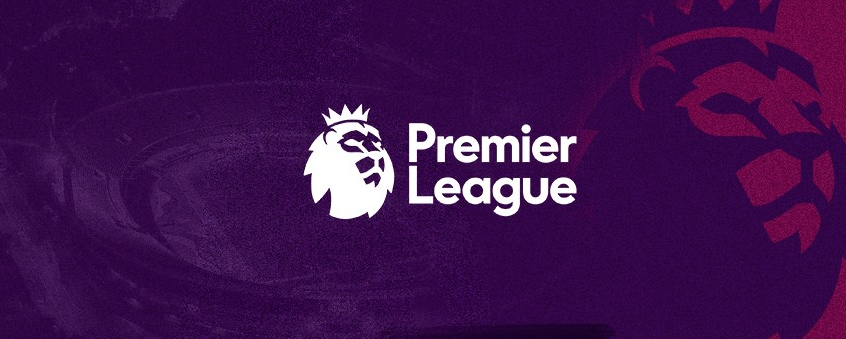

<div align="center">
   
</div>
<br/>
<div align="center">
   <a href="#-tecnologias-utilizadas">
      
      
      
   </a>
</div>

</br>


## 💻 About

📁 Premier League - This is a mobile app that allows users to view all Premier League 21/22 teams. 
The project was developed for the Mobile Applications course as a work during college.


## 🎨 Layout

Developed layout

<div align="center">
  
</div>


## 🛠 Technologies

The following tools were used in the construction of the project:

- [React Native][ReactNative]
- [TypeScript][TypeScript]
- [Styled Components][StyledComponents]
- [react-native-animatable][react-native-animatable]
- [Expo][expo]

## 🚀 Getting Started

1. Front End

### 🎲 Running the Front End

```bash
# Clone this repository
$ git clone https://github.com/YagoVela/premier-league.git

# If you don't have Expo
$ npm install --global expo-cli

# Go to the project folder in terminal/cmd
$ cd premier-league

# Install the dependencies
$ yarn

# Run the application in development mode
$ expo start

# Download the Expo Go APP and point your cell phone camera at the qr code
```


## 📝 License

Made by Yago Vela 👋🏽 [Entre em contato!](https://github.com/YagoVela)

## 👏 Acknowledgements
- [Rodrigo Gonçalves S.](https://github.com/rodrigorgtic)


[ReactNative]: https://reactnative.dev/
[Typescript]: https://www.typescriptlang.org/
[StyledComponents]: https://styled-components.com/
[react-native-animatable]: https://github.com/oblador/react-native-animatable
[expo]:https://expo.dev/
